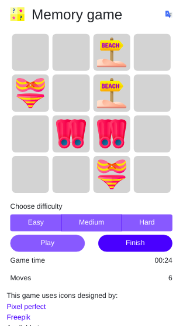

# MemoryGame

This project was generated with [Angular CLI](https://github.com/angular/angular-cli) version 9.0.3.

---

## Description

This is a match pairs game with three difficult levels. You must pair each image with their equal.

---

## Run the app

### Local machine

For run the app using the local machine as an app server, after cloning the project in a local folder, you must start the server, into the project folder, using the command:

`ng serve`

Then, you have to navigate to the address:

`http://localhost:4200`

### In the web

You can run the app navigating to this URL:

[demo](http://memory-game.guitxo.com/)

---

## Screenshot

